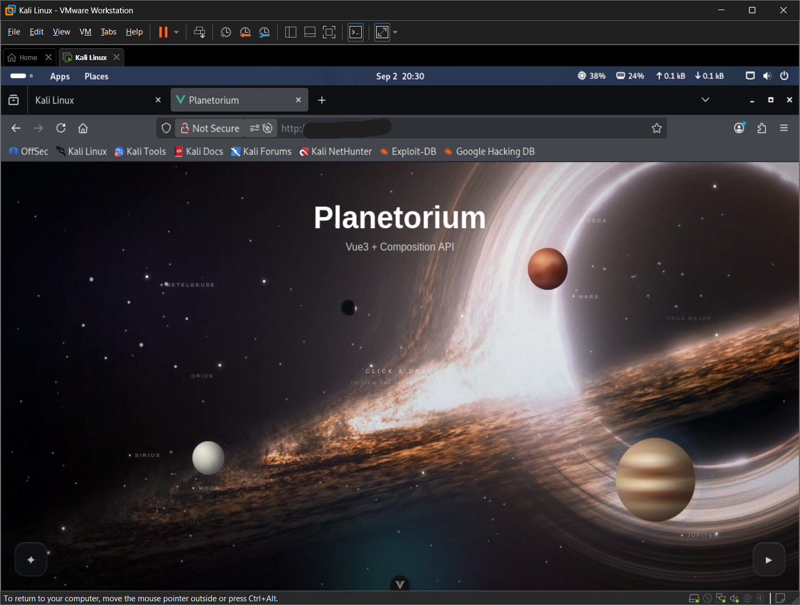

# Web Application Penetration Testing

Authorized web application penetration testing project focused on assessing the security of a Vue/Vite-based web application through reconnaissance, manual analysis, automated security testing, vulnerability validation, remediation, and retesting.

## Target

**Application:** Planetorium  
**Environment:** Authorized local development deployment  
**Technology:** Vue.js + Vite  
**Testing Platform:** Kali Linux

## Target Application

---

## Table of Contents

- [Project Overview](#project-overview)
- [Objectives](#objectives)
- [Methodology](#methodology)
- [Testing Scope](#testing-scope)
- [Tools](#tools)
- [Testing Progress](#testing-progress)
- [Documentation](#documentation)
- [Evidence](#evidence)
- [Authorization](#authorization)

---

## Project Overview

This project documents a hands-on web application penetration test performed against an authorized Planetorium deployment.

The assessment combines manual security analysis with industry-standard reconnaissance and web security tools.

The objective is to identify, validate, document, and remediate security weaknesses while maintaining clear evidence of the testing process.

---

## Objectives

- Identify exposed services and technologies
- Analyze HTTP and browser behavior
- Discover application endpoints and attack surfaces
- Assess authentication and authorization controls
- Test input validation and common web vulnerabilities
- Assess API security where applicable
- Validate identified vulnerabilities
- Document security findings and evidence
- Provide remediation recommendations
- Perform retesting after remediation

---

## Methodology

The assessment follows:

**Learn → Test → Capture Evidence → Verify → Assess Impact → Remediate → Retest**

Testing is performed progressively from reconnaissance to manual analysis, automated testing, vulnerability validation, and final reporting.

---

## Testing Scope

### In Scope

- Web application functionality
- HTTP requests and responses
- Client-side resources
- Routes and endpoints
- Authentication and authorization
- Sessions and browser storage
- Input validation
- API behavior
- Security headers
- CORS configuration
- Information disclosure
- Business logic
- Relevant services exposed by the authorized test environment

### Out of Scope

- Third-party systems
- Unauthorized systems
- Other users' systems or data
- Denial-of-service testing
- Destructive testing
- Social engineering
- Physical security testing
- Netlify infrastructure

---

## Tools

| Tool | Purpose |
|---|---|
| Firefox DevTools | Browser and network analysis |
| curl | HTTP request and response analysis |
| Nmap | Port and service enumeration |
| WhatWeb | Web technology fingerprinting |
| Wappalyzer | Client-side technology identification |
| Burp Suite | HTTP interception and manual testing |
| OWASP ZAP | Automated web security testing |
| ffuf | Endpoint and parameter discovery |
| Nikto | Web server security assessment |
| Gobuster | Content and directory discovery |
| SQLMap | SQL injection testing where applicable |
| Python | Custom security testing and automation |
| OpenSSL | TLS/security analysis where applicable |

## Testing Progress

| Phase | Status |
|---|---|
| Reconnaissance | Completed |
| HTTP & Browser Analysis | Completed |
| Burp Suite | Completed |
| OWASP ZAP | In Progress |
| Endpoint Discovery | Pending |
| Authentication Testing | Pending |
| Authorization Testing | Pending |
| Session Security | Pending |
| Input Validation | Pending |
| XSS Testing | Pending |
| CSRF Testing | Pending |
| API Security | Pending |
| Vulnerability Validation | Pending |
| Remediation | Pending |
| Retesting | Pending |
| Final Report | Pending |

---
## Documentation

### Reconnaissance

Initial reconnaissance covering Nmap, WhatWeb, and Wappalyzer.

[View Reconnaissance Documentation](reconnaissance/README.md)

### Web Application Testing

Manual HTTP and browser-based analysis using curl and Firefox Developer Tools.

[View Web Testing Documentation](web-testing/README.md)

### Burp Suite

[View Burp Suite Documentation](burp-suite/README.md)

### OWASP ZAP

[View OWASP ZAP Documentation](owasp-zap/README.md)

### Vulnerability Testing

[View Vulnerability Testing](vulnerability-testing/README.md)

### Findings

[View Security Findings](findings/findings.md)

### Remediation

[View Remediation](remediation/fixes.md)

### Final Report

[View Final Report](reports/final-report.md)

---

## Evidence

Evidence screenshots are organized within the relevant testing sections.

### Reconnaissance Evidence

- Nmap
- WhatWeb
- Wappalyzer
- Target application

[View Reconnaissance Evidence](reconnaissance/README.md)

### Web Testing Evidence

- curl
- Firefox Developer Tools
- HTTP request and response analysis

[View Web Testing Evidence](web-testing/README.md)

All public evidence is sanitized to remove local IP addresses and other environment-specific or sensitive information.

---

## Authorization

Testing is performed with explicit permission from the application owner against the authorized local development environment.

The assessment is limited to the defined scope and does not include unauthorized systems or third-party infrastructure.
