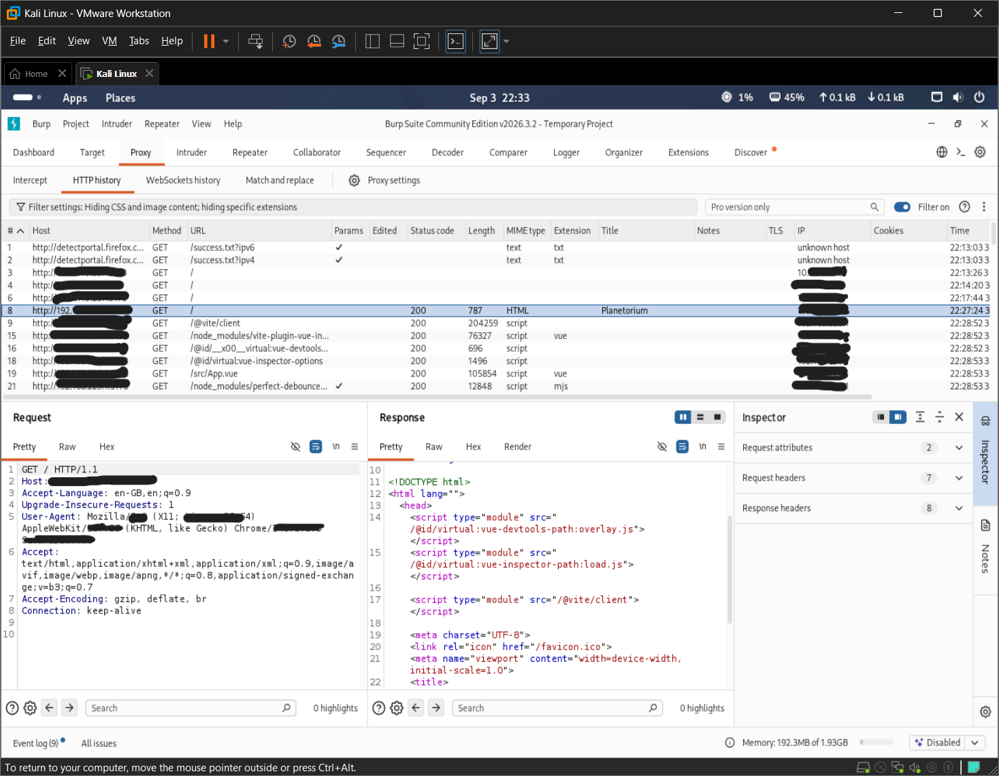
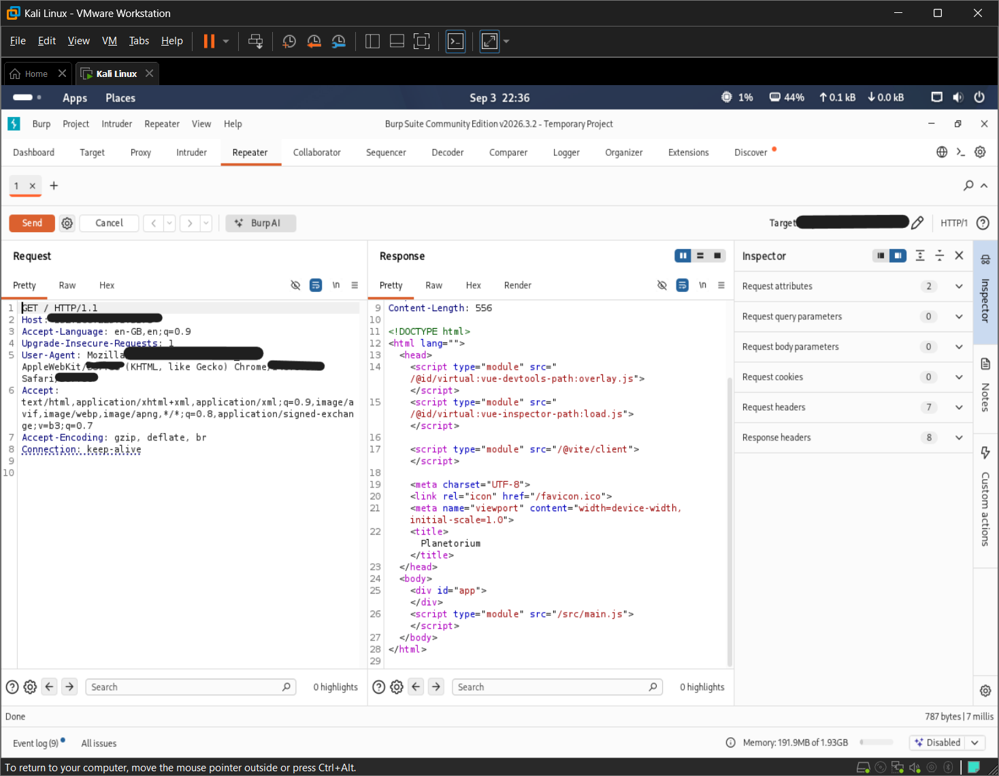
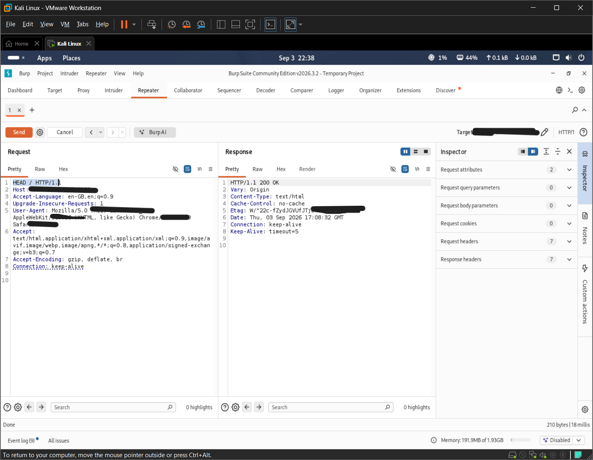
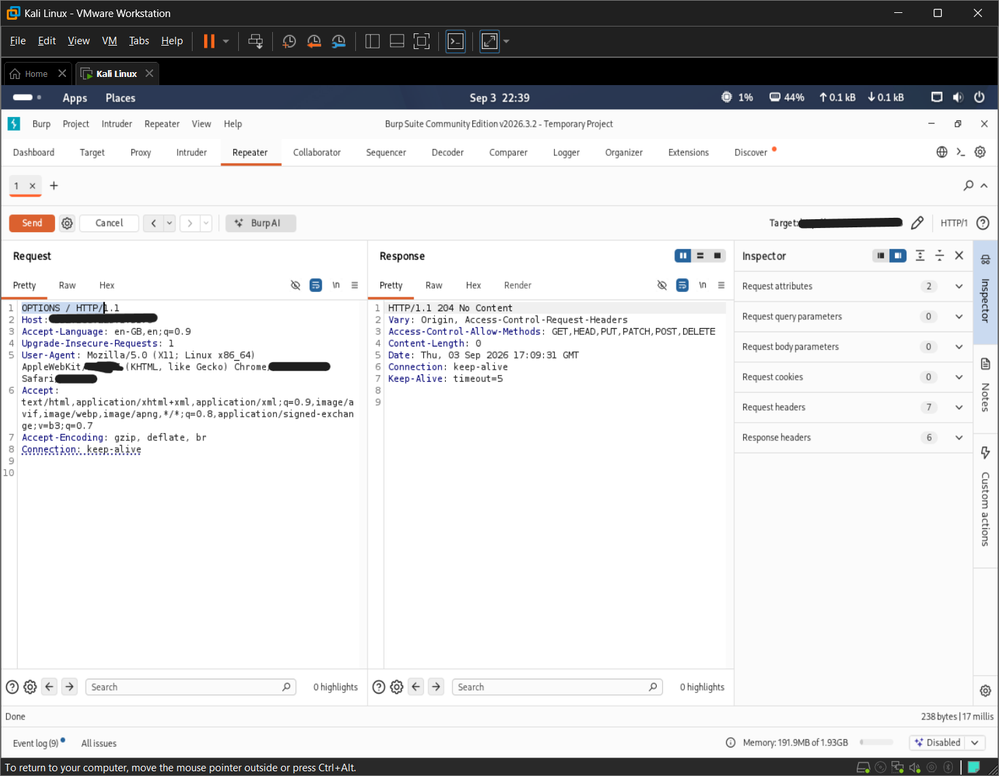
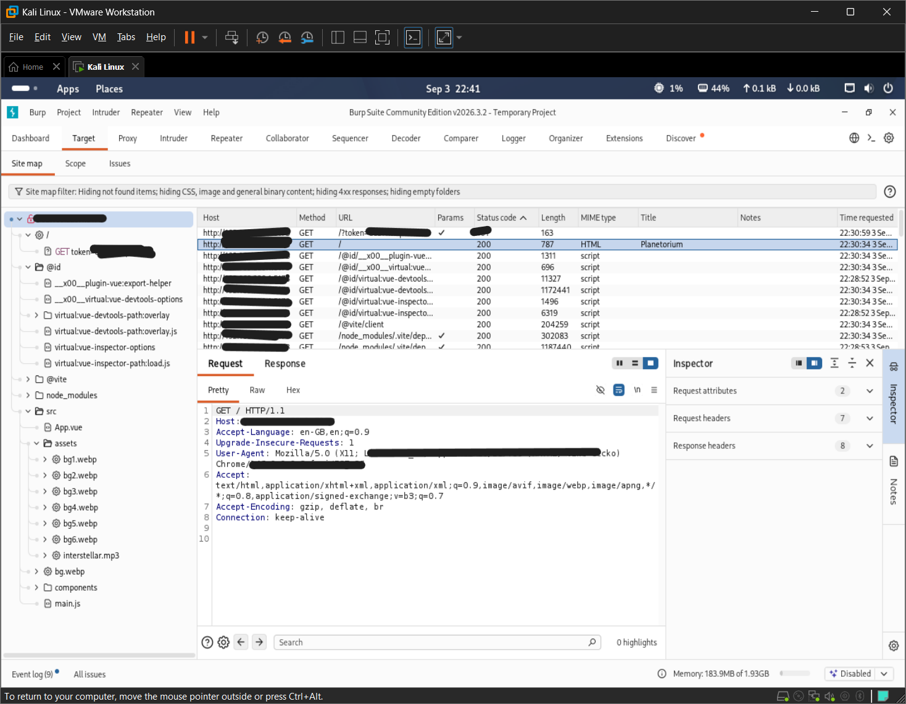
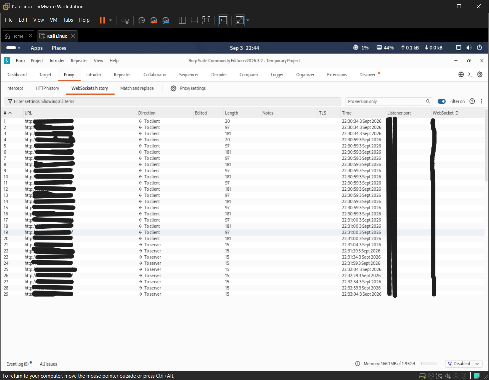
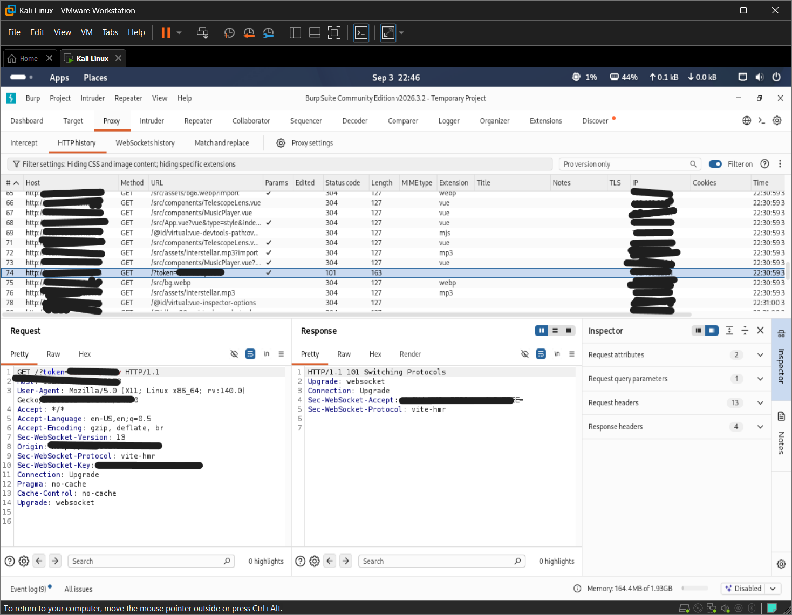
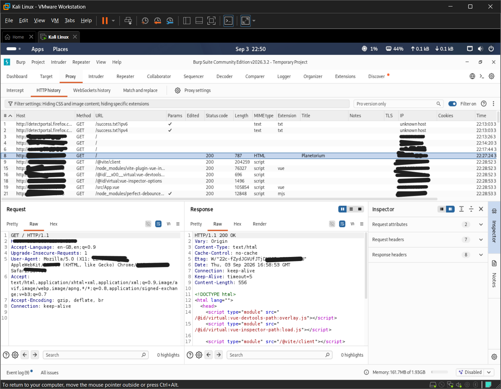
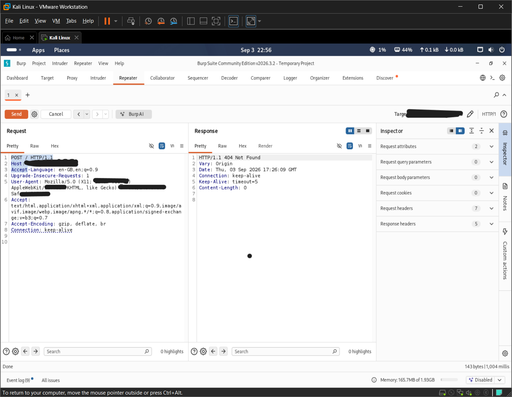

# Burp Suite

Burp Suite was used to intercept, inspect, analyze, replay, and manually modify HTTP and WebSocket traffic for the authorized Planetorium web application.

## Testing Performed

### 1. HTTP History Analysis

Burp Suite Proxy HTTP History was used to observe HTTP requests generated by the application.

Observed application resources included:

- Main application document
- Vite development resources
- Vue-related resources
- JavaScript modules
- Application source files
- Static assets

#### Evidence



---

### 2. Burp Repeater

A captured HTTP request was sent to Burp Repeater for manual request manipulation and response analysis.

Burp Repeater was used to understand how individual HTTP requests could be modified, replayed, and analyzed independently from the browser.

#### Evidence



---

### 3. HTTP HEAD Method Testing

The HTTP method was changed to `HEAD` and the request was sent to the application.

#### Request

```http
HEAD / HTTP/1.1
Host: TARGET
```

#### Observed Response

```http
HTTP/1.1 200 OK
Content-Type: text/html
Cache-Control: no-cache
```

The server accepted the `HEAD` request and returned HTTP response headers without the normal response body.

No security vulnerability was confirmed from this behavior.

#### Evidence



---

### 4. HTTP OPTIONS Method Testing

The HTTP method was changed to `OPTIONS` to inspect the server's advertised HTTP methods.

#### Request

```http
OPTIONS / HTTP/1.1
Host: TARGET
```

#### Observed Response

```http
HTTP/1.1 204 No Content
Access-Control-Allow-Methods: GET,HEAD,PUT,PATCH,POST,DELETE
```

The server returned an `Access-Control-Allow-Methods` header listing supported HTTP methods.

This behavior alone does not confirm a security vulnerability. Further CORS and authorization testing would be required to determine whether any method is improperly accessible.

#### Evidence



---

### 5. Site Map Analysis

Burp Suite Site Map was used to identify application resources and accessible paths.

The analysis revealed resources including:

- `/`
- `/src/`
- `/src/App.vue`
- `/src/main.js`
- `/src/components/`
- `/src/assets/`
- Vite development resources
- Vue development resources
- WebSocket-related resources

The Site Map provided useful visibility into the application's exposed development resources and attack surface.

#### Evidence



---

### 6. WebSocket History Analysis

Burp Suite WebSockets history was inspected to identify WebSocket communication generated by the application.

WebSocket traffic was observed between the browser and the Vite development server.

The observed WebSocket traffic was associated with the development environment and Hot Module Replacement functionality.

#### Evidence



---

### 7. WebSocket Handshake Analysis

The WebSocket handshake was inspected in Burp Suite.

#### Observed Request

```http
GET /?token=<dynamic-token> HTTP/1.1
Host: TARGET
Upgrade: websocket
Connection: Upgrade
Sec-WebSocket-Version: 13
Sec-WebSocket-Protocol: vite-hmr
```

The request successfully established a WebSocket connection used by the Vite development environment for Hot Module Replacement (HMR).

The observed `token` value was dynamic development-server traffic and was not treated as an application authentication token.

No application authentication vulnerability was concluded from this observation.

#### Evidence



---

### 8. HTTP Response Header Analysis

A normal application request was intercepted and its HTTP response headers were inspected.

#### Observed Response

```http
HTTP/1.1 200 OK
Vary: Origin
Content-Type: text/html
Cache-Control: no-cache
ETag: W/"..."
Connection: keep-alive
```

Several commonly deployed security headers were not present in the observed development-server response, including:

- `Content-Security-Policy`
- `X-Content-Type-Options`
- `X-Frame-Options`
- `Referrer-Policy`
- `Strict-Transport-Security`

However, the application was being tested through a Vite development server rather than a production deployment.

Therefore, the missing headers were recorded as an observation for further assessment and were not immediately classified as a production vulnerability.

#### Evidence



---

### 9. HTTP Method Manipulation

The HTTP method was changed from `GET` to `POST` and the modified request was sent to the application.

#### Request

```http
POST / HTTP/1.1
Host: TARGET
```

#### Observed Response

```http
HTTP/1.1 404 Not Found
```

The server did not process the modified request as a valid application route.

No security vulnerability was confirmed from this behavior.

#### Evidence



---

### 10. Query Parameter Testing

A benign query parameter was added to the request to observe how the application handled additional URL parameters.

#### Request

```http
GET /?test=123 HTTP/1.1
Host: TARGET
```

#### Observed Response

```http
HTTP/1.1 200 OK
Content-Type: text/html
```

The parameter did not produce an observable error, unexpected response, or visible application behavior change.

No security vulnerability was confirmed from this test.

No separate screenshot was recorded for this test.

---

## Results

Burp Suite provided visibility into the application's HTTP and WebSocket traffic and allowed individual requests to be replayed and manually modified.

The following areas were examined:

- HTTP request traffic
- HTTP response traffic
- HTTP methods
- Response headers
- Query parameters
- Application resources
- Burp Site Map
- WebSocket traffic
- WebSocket handshake
- Vite development-server behavior

The tests performed during this phase did not establish a confirmed exploitable vulnerability.

The absence of certain security headers was recorded as an observation because the application was running through a Vite development server.

Further vulnerability testing will cover:

- Authentication
- Authorization
- Session management
- Input validation
- Cross-Site Scripting (XSS)
- Cross-Site Request Forgery (CSRF)
- IDOR/BOLA
- API security
- CORS configuration
- Information disclosure
- Client-side security
- Business logic
- Rate limiting
- File upload security
- Other applicable OWASP security areas

---

## Evidence

All Burp Suite evidence for this testing phase is stored in the `screenshots/` directory.

Current evidence files:

- `01-burp-http-history.png`
- `02-burp-repeater.png`
- `03-burp-head-method.png`
- `04-burp-options-method.png`
- `05-burp-site-map.png`
- `06-burp-websocket-history.png`
- `07-burp-websocket-handshake.png`
- `08-burp-http-response-headers.png`
- `09-burp-http-method-testing.png`

The screenshots are intended for authorized security assessment documentation.

Before public release, sensitive information such as local IP addresses, dynamic tokens, credentials, session identifiers, cookies, API keys, personal information, or other private data must be sanitized or removed.

---

## Assessment Note

All testing documented in this section was performed against the authorized local development deployment of the Planetorium web application.

The testing was conducted with permission from the application owner.

The results documented here represent observations from the tested development environment and should not automatically be interpreted as findings against a production deployment.