# OWASP ZAP Testing

## Overview

OWASP ZAP was used to perform automated and passive security analysis of the authorized Planetorium web application.

Testing included:

- Passive security analysis
- HTTP request/response inspection
- WebSocket traffic analysis
- Active vulnerability scanning
- Manual validation of scanner findings
- False-positive identification

---

## Target

**Application:** Planetorium  
**Environment:** Local development environment  
**Technology:** Vue.js / Vite  
**Authorization:** Testing performed with explicit authorization from the application owner.

> Sensitive local IP addresses, tokens, filesystem paths, and other identifying information are redacted from public evidence.

---

## Testing Configuration

| Setting | Value |
|---|---|
| Tool | OWASP ZAP 2.17.0 |
| Mode | Standard Mode |
| Scan Type | Active + Passive |
| Active Scan Policy | Dev Standard |
| Recurse | Enabled |
| Target | Local authorized development instance |

---

## Passive Scan Findings

ZAP identified several security-header related findings:

| Finding | ZAP Risk | Assessment |
|---|---|---|
| Content Security Policy (CSP) Header Not Set | Medium | Valid security hardening finding |
| Missing Anti-clickjacking Header | Medium | Valid security hardening finding |
| X-Content-Type-Options Header Missing | Low | Valid security hardening finding |
| Information Disclosure - Information in Browser localStorage | Informational | Not confirmed as a vulnerability |
| Information Disclosure - Sensitive Information in URL | Informational | Vite HMR development token; not confirmed as sensitive application data |
| Information Disclosure - Suspicious Comments | Informational | Development/dependency comments; not confirmed as a vulnerability |
| Modern Web Application | Informational | Technology/behavior observation |

### Security Header Findings

The following missing security headers were observed:

- `Content-Security-Policy`
- `X-Frame-Options` / equivalent anti-clickjacking protection
- `X-Content-Type-Options`

These findings are documented as **security hardening issues**. Because the target is a Vite development server, they should not automatically be treated as production vulnerabilities.

---

## Active Scan

An initial scan using the default policy generated a large number of requests and was stopped due to the resource-intensive nature of the default configuration.

A second scan was performed using the lighter **Dev Standard** policy.

### Result

- **Scan completion:** 100%
- **Requests:** 4,970
- **Current scans:** 0
- **New active-scan alerts:** 0

The active scan did not identify additional vulnerabilities beyond the findings already observed during passive analysis.

---

## Manual Validation

Automated scanner results were manually reviewed before being considered security findings.

### Base64 Disclosure in WebSocket Message

ZAP detected Base64-encoded content in WebSocket traffic.

Manual inspection showed that the decoded content was associated with a Vite development/import-analysis error message rather than credentials, session tokens, cookies, or other application secrets.

**Assessment:** Informational / development-server behavior. Not treated as a confirmed vulnerability.

### Email Address Found in WebSocket Message

ZAP reported an email address in WebSocket traffic.

Manual inspection showed the detected pattern was:

`@keyframes`

This is CSS syntax and not an email address.

**Assessment:** False positive.

### Sensitive Information in URL

ZAP detected a `token` parameter in the URL.

The request was associated with the Vite HMR WebSocket mechanism (`vite-hmr`). The observed token was therefore treated as a development-server HMR token rather than an application authentication or session token.

**Assessment:** Informational development-server observation. Not treated as a confirmed vulnerability.

### Suspicious Comments

ZAP detected comments in application and dependency JavaScript.

Manual review showed that these were normal source-code/dependency comments and development information rather than exposed credentials or security secrets.

**Assessment:** Informational. Not treated as a confirmed vulnerability.

---

## Evidence

### Passive Scan

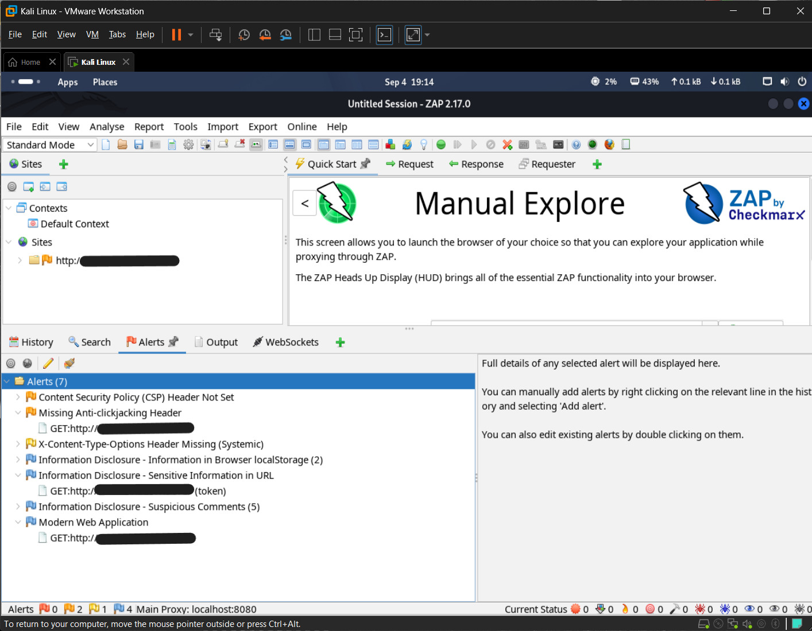

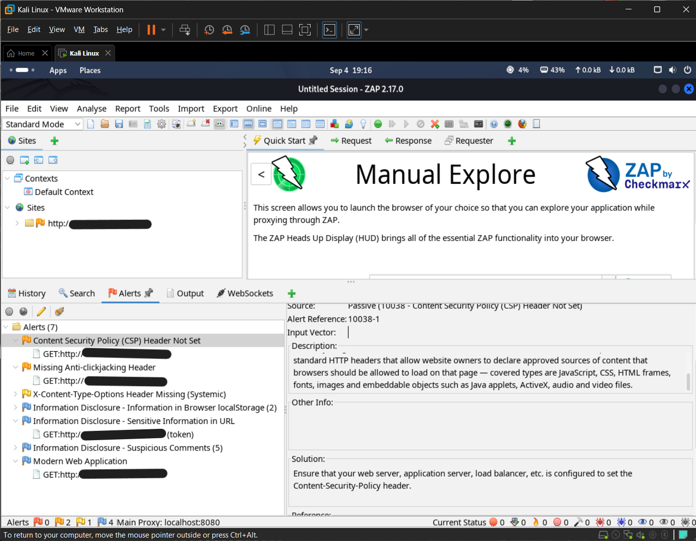

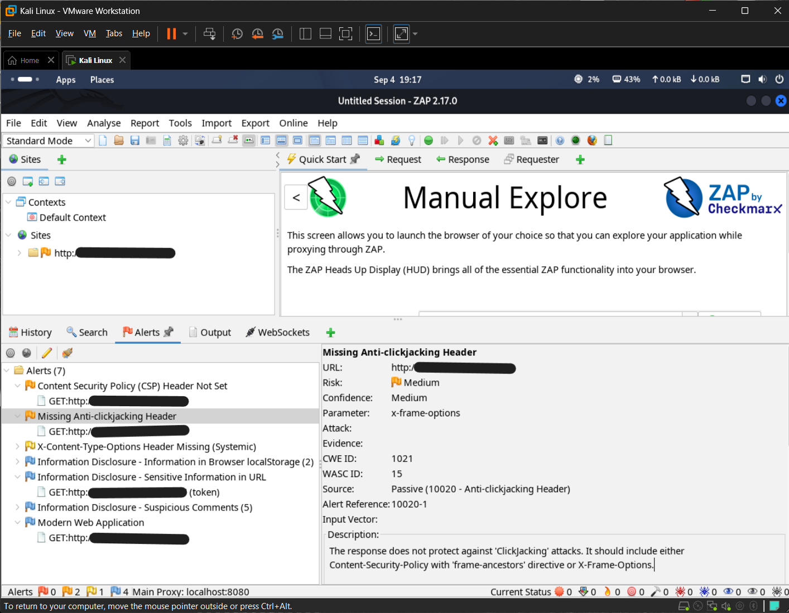

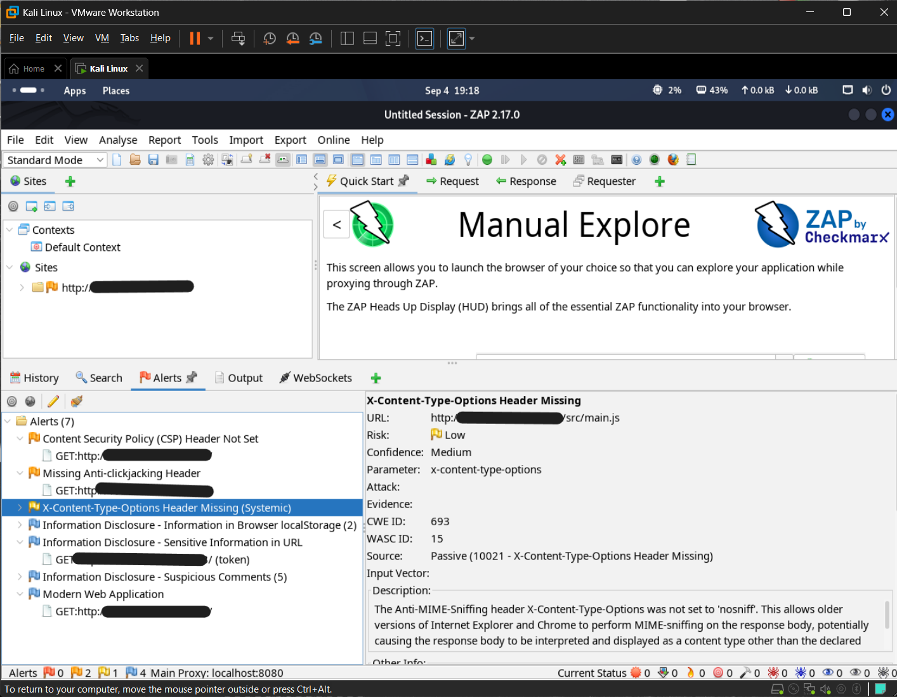

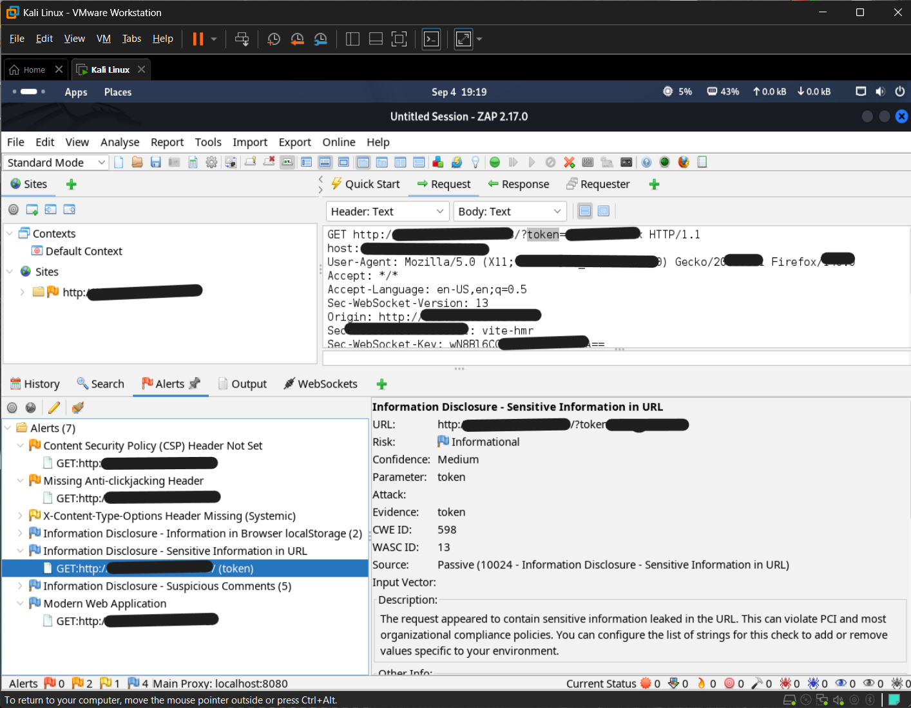

### Active Scan

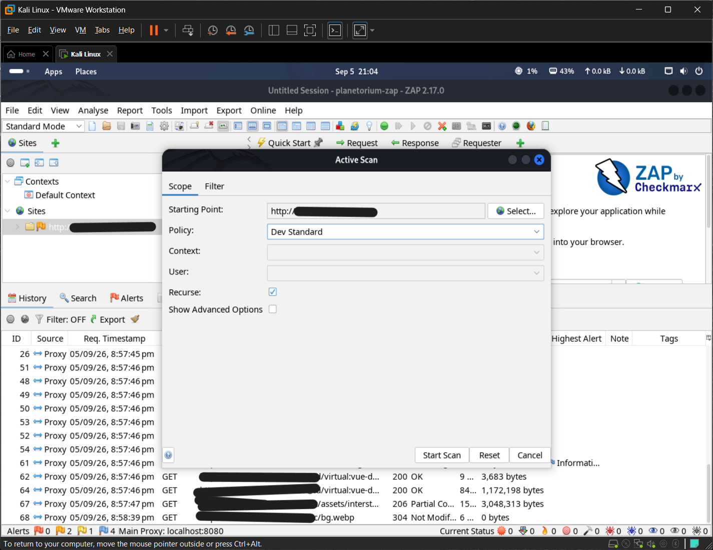

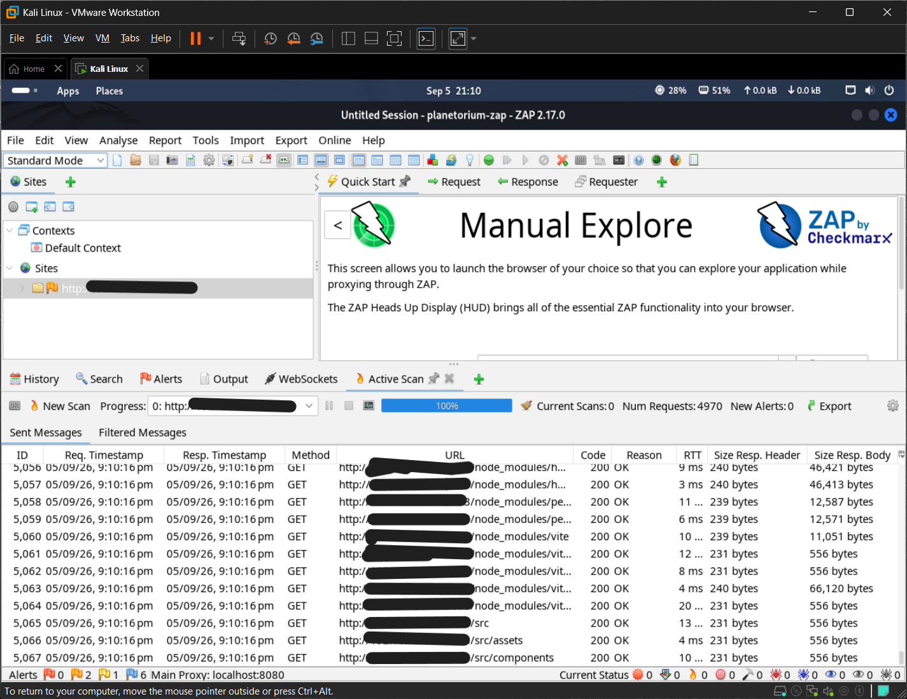

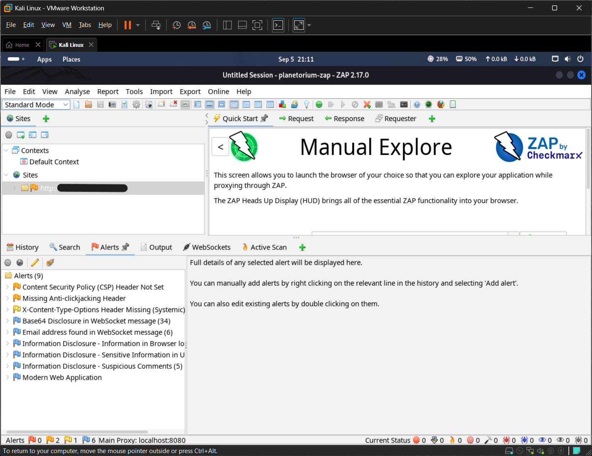

### Manual Validation

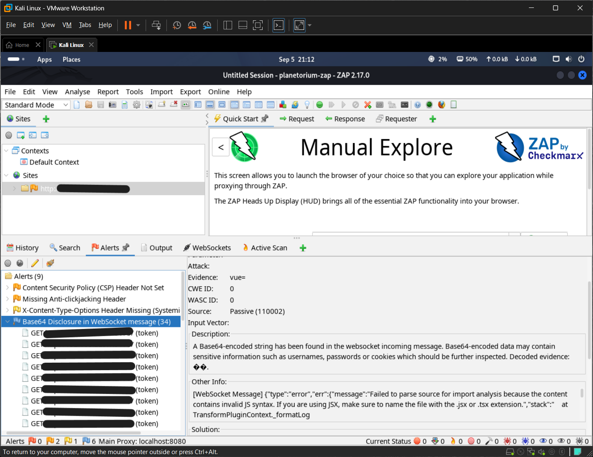

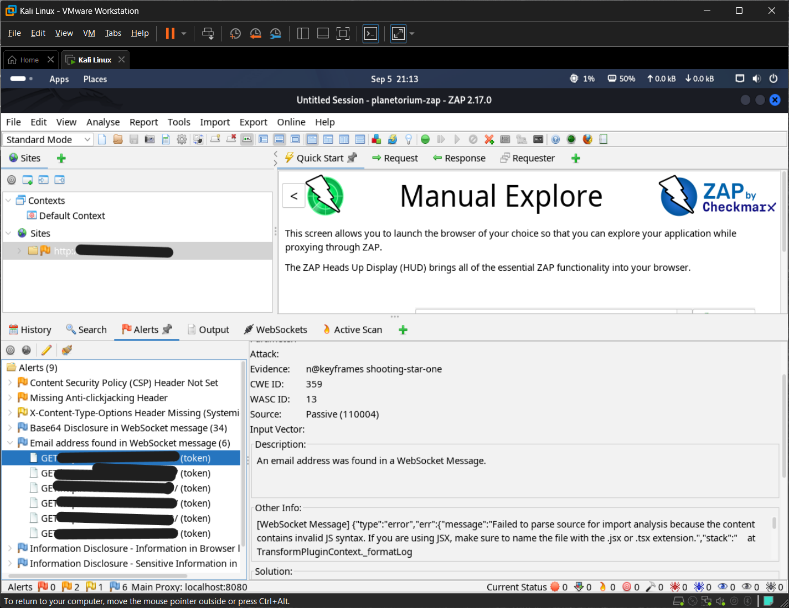

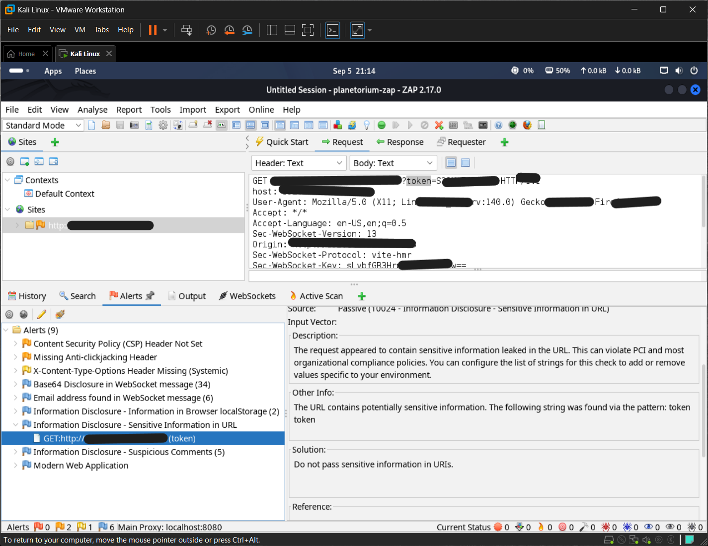

---

## Key Takeaways

- Passive analysis identified missing browser security headers.
- Active scanning with the development-oriented `Dev Standard` policy completed successfully.
- 4,970 requests were generated during the active scan.
- No new active-scan alerts were identified.
- Several informational findings were manually validated.
- Scanner-generated false positives were excluded from confirmed vulnerabilities.
- Development-server behavior was separated from application-level security findings.

---

## Status

**OWASP ZAP testing: Completed**

Next phases:

- Endpoint discovery
- Authentication testing
- Authorization testing
- Session security
- Input validation
- XSS testing
- CSRF testing
- API security testing
- Vulnerability validation
- Remediation
- Retesting
- Final report