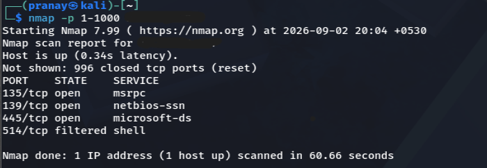
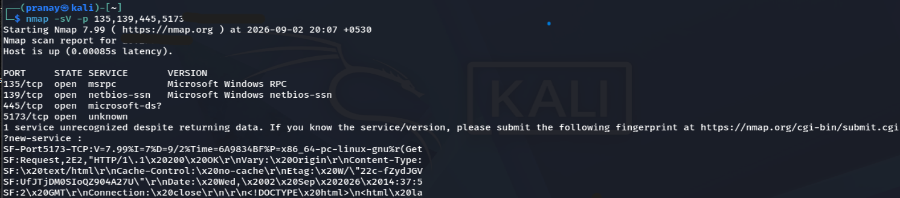
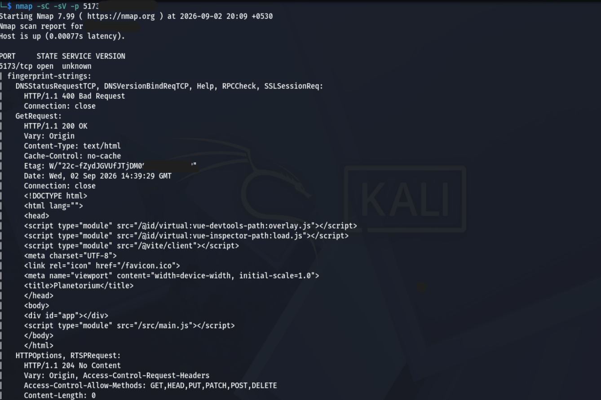
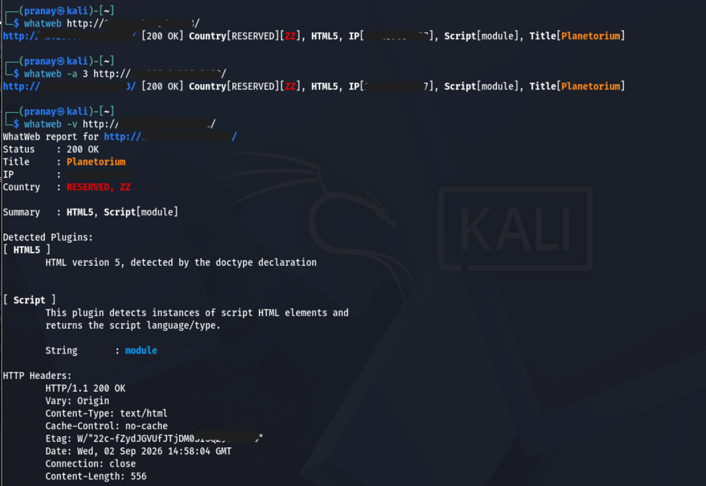

# Reconnaissance

Initial reconnaissance was performed against the authorized Planetorium web application to identify exposed services, application technologies, and basic web characteristics.

## Nmap

Nmap was used for host discovery, port enumeration, service detection, and basic service fingerprinting.

### Commands Used

`nmap TARGET_IP` — Basic TCP port scan.

`nmap -sV TARGET_IP` — Service and version detection.

`nmap -p 1-1000 TARGET_IP` — Scans TCP ports 1–1000.

`nmap -sV -p 135,139,445,5173 TARGET_IP` — Targeted service and version detection.

`nmap -sC -sV -p 5173 TARGET_IP` — Runs default NSE scripts with service/version detection against the application port.

### Results

- Host was reachable.
- Ports `135`, `139`, and `445` were identified as Windows services on the test host.
- Port `5173` was identified as the Planetorium web application.
- Nmap detected HTTP responses on port `5173`, although it did not identify the service by name.
- HTTP responses from port `5173` revealed Vite development-server behavior.

The discovered Windows services are host-level services and are not treated as Planetorium vulnerabilities.

### Evidence

#### Initial Port Scan

#### Port Range Scan

#### Targeted Service Enumeration

#### Default NSE Scripts and Service Detection

---

## WhatWeb

WhatWeb was used to identify web technologies and basic HTTP characteristics exposed by the application.

### Commands Used

`whatweb http://TARGET:5173/` — Basic web technology identification.

`whatweb -a 3 http://TARGET:5173/` — Aggressive technology detection.

`whatweb -v http://TARGET:5173/` — Verbose output including detailed detection information and HTTP headers.

### Results

WhatWeb identified:

- HTTP `200 OK`
- Page title: `Planetorium`
- HTML5
- JavaScript module usage
- HTTP response headers
- Web application served on port `5173`

### Evidence

---

## Wappalyzer

Wappalyzer was used for browser-based technology identification.

### Result

- JavaScript Framework: `Vue.js`

### Evidence

---

## Target Overview

The authorized Planetorium application was successfully accessed from the Kali testing environment.

---

## Reconnaissance Summary

| Tool | Purpose | Key Result |
|---|---|---|
| Nmap | Port and service enumeration | `5173/tcp` identified as the application port |
| WhatWeb | Web technology fingerprinting | HTML5, JavaScript modules, Planetorium |
| Wappalyzer | Client-side technology detection | Vue.js |

Reconnaissance results are used to guide subsequent security testing. Detection results alone are not considered confirmed vulnerabilities.