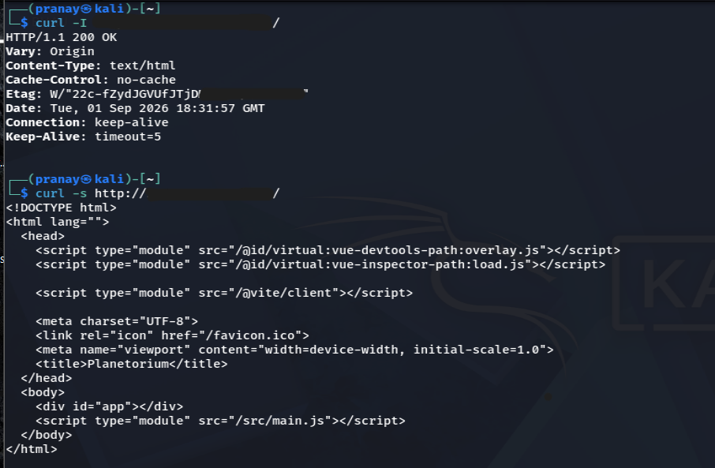
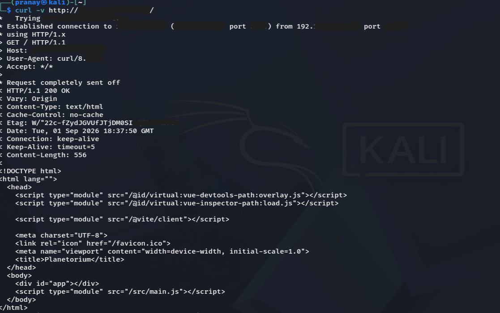
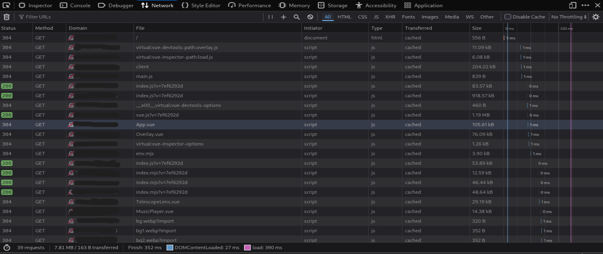
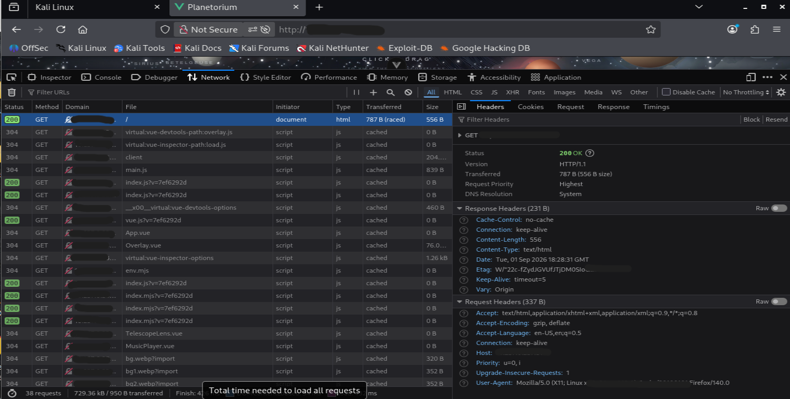

# Web Application Testing

Manual HTTP and browser-based security analysis of the authorized Planetorium web application.

## HTTP Analysis

### curl

Performed:

- HTTP response analysis
- Request/response header inspection
- GET request analysis
- Verbose HTTP analysis
- OPTIONS request analysis

Key observations:

- `HTTP/1.1 200 OK`
- `Content-Type: text/html`
- `Cache-Control: no-cache`
- `ETag`
- `Vary: Origin`
- OPTIONS returned `204 No Content`
- Supported methods were identified through the OPTIONS response

### Browser DevTools

Firefox Developer Tools were used to analyze:

- Network requests
- HTTP methods and status codes
- Request and response headers
- JavaScript resources
- Vue/Vite development resources
- Application initialization

## Evidence

### curl Response Headers

### curl Verbose HTTP Analysis

### Browser Network Analysis

### HTTP Request and Response Headers

## Assessment Notes

The application is currently running through a Vite development server. Development-server behavior and missing production security headers are therefore treated as observations rather than confirmed vulnerabilities.

All potential findings will be manually verified before being reported.

## Status

- [x] curl HTTP analysis
- [x] Browser Network analysis
- [x] Request/response header analysis
- [x] JavaScript resource identification
- [x] Vue/Vite resource identification